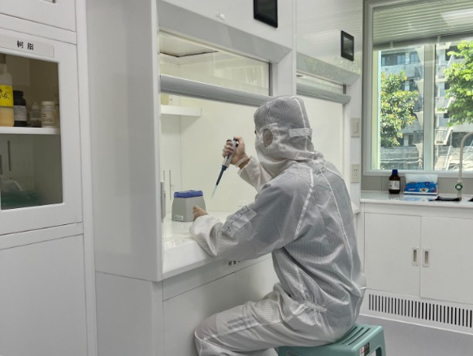
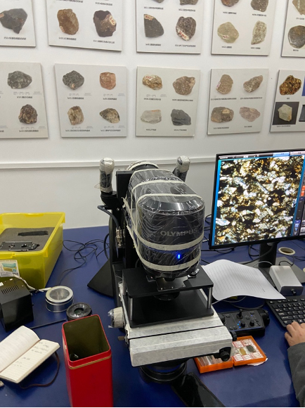
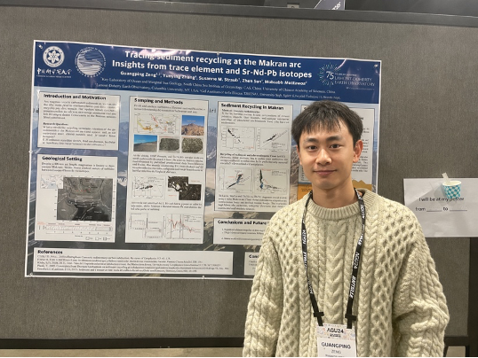
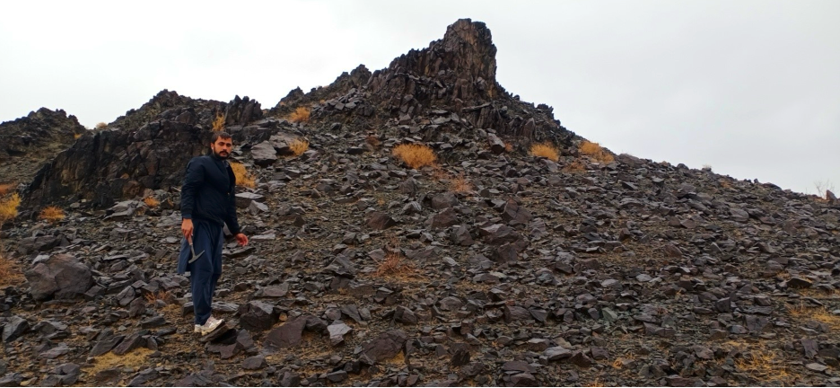

The Makran system is a natural laboratory for testing how unusually thick
sediment inputs influence carbon, water, and trace-element transfer from the
subducting plate into the overriding arc.

I use petrology, isotope geochemistry, and thermodynamic constraints to link
sedimentary inputs, slab-derived fluids and melts, and volcanic outputs. This
work connects surface carbon reservoirs with deep recycling and arc
geochemical signatures.

Field and laboratory work for this project move between clean chemistry,
microscope checks, isotope models, conference discussions, and field support in
Pakistan.

The AGU Fall Meeting 2024 iPoster for this work is available online:
[Sediment Recycling at the Makran Arc](https://agu24.ipostersessions.com/?s=8B-2D-04-8D-3E-E9-9F-7D-29-05-91-4C-38-C6-BD-A1).

A related published study on the Makran accretionary wedge maps
mud-intrusive and mud-extrusive systems, linking seismic structures, fluid
migration, and wedge-scale deformation:
[Gardezi et al. (2026)](/publications/makran-mud-systems/).

  <figure class="gp-photo-card">
    
    <figcaption><strong>Isotope preparation.</strong> Element separation in the clean lab during isotope pretreatment.</figcaption>
  </figure>
  <figure class="gp-photo-card">
    
    <figcaption><strong>Petrographic check.</strong> Observing mineral textures before interpreting geochemical signals.</figcaption>
  </figure>
  <figure class="gp-photo-card">
    
    <figcaption><strong>AGU 2024.</strong> Presenting the Makran sediment recycling iPoster at AGU Fall Meeting 2024.</figcaption>
  </figure>
  <figure class="gp-photo-card gp-photo-card-wide">
    
    <figcaption><strong>Field support.</strong> Colleague Mubashir helped collect samples from difficult field areas in Pakistan.</figcaption>
  </figure>

