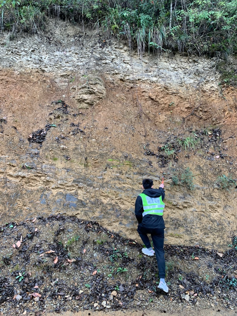
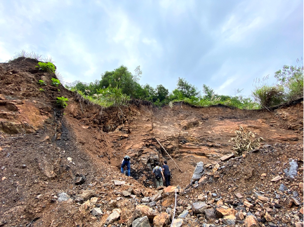
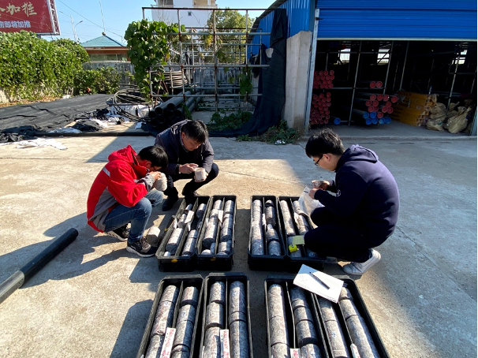
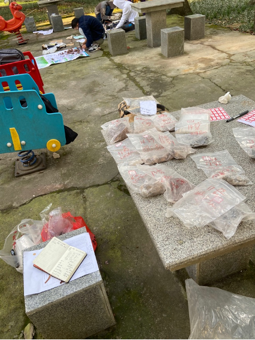

This project uses sequence stratigraphy and geochemical records to reconstruct
depositional environments in the South Poyang Basin.

The work links paleogeography, water-depth and sediment-supply changes, and
organic matter enrichment. It represents the surface-environment and resource
side of my broader interest in Earth material cycles.

South Poyang fieldwork was a mix of outcrops, cores, sampling teamwork, and
some very improvised logistics.

  <figure class="gp-photo-card">
    
    <figcaption><strong>Human scale bar.</strong> Using myself as a field scale beside a South Poyang outcrop.</figcaption>
  </figure>
  <figure class="gp-photo-card gp-photo-card-wide">
    
    <figcaption><strong>Team sampling.</strong> Group sampling at the outcrop, with careful notes and full sample bags.</figcaption>
  </figure>
  <figure class="gp-photo-card gp-photo-card-wide">
    
    <figcaption><strong>Core description.</strong> Reading the subsurface one core box at a time.</figcaption>
  </figure>
  <figure class="gp-photo-card">
    
    <figcaption><strong>Sample sorting, field edition.</strong> Preliminary sample sorting beside a children's spring rider.</figcaption>
  </figure>

