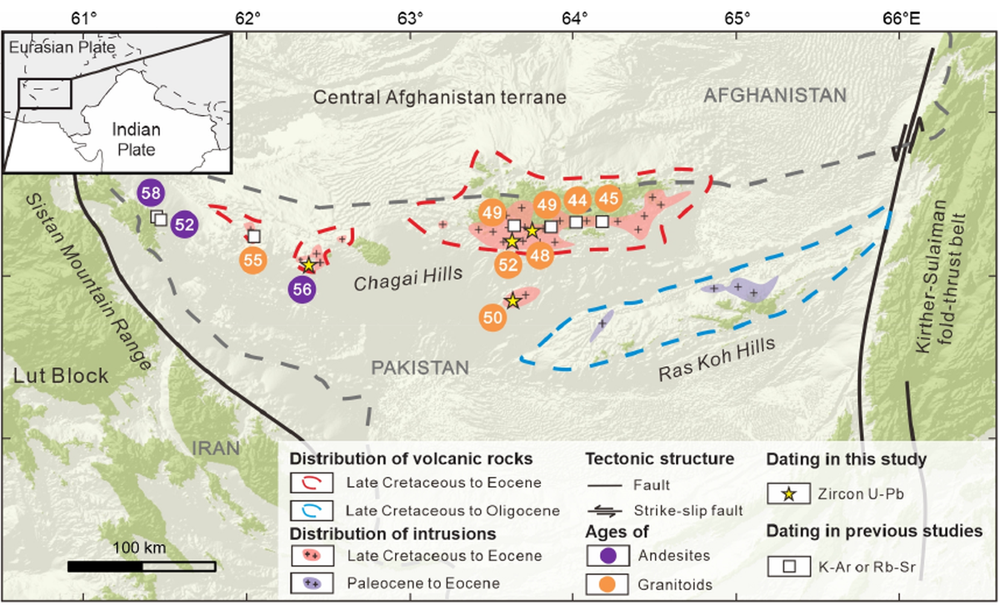

## Abstract

This paper uses petrology, zircon U-Pb geochronology, whole-rock geochemistry,
and Sr-Nd isotopes from the Chagai Hills to track the shift from Neo-Tethyan
subduction to India-Eurasia collision in the western collision zone. Andesites
around 56.2 Ma record subduction-modified mantle sources, whereas granodiorites
around 50.0 Ma and granites at 51.6-47.5 Ma reflect collision-related
lower-crust and mantle processes.

The results place the local subduction-collision transition between 56.2 and
51.6 Ma and support a diachronous India-Eurasia collision pattern that began
near central Gangdese and propagated laterally.

Journal of Earth Science, 37(3), 1055-1069. Published in June 2026.
DOI: [10.1007/s12583-025-0244-z](https://doi.org/10.1007/s12583-025-0244-z).

  <a href="https://doi.org/10.1007/s12583-025-0244-z">DOI</a>
  <a href="mailto:zengguangping22@mails.ucas.ac.cn">Email</a>
  <a href="https://scholar.google.com/citations?user=MfU38ZMAAAAJ">Google Scholar</a>

