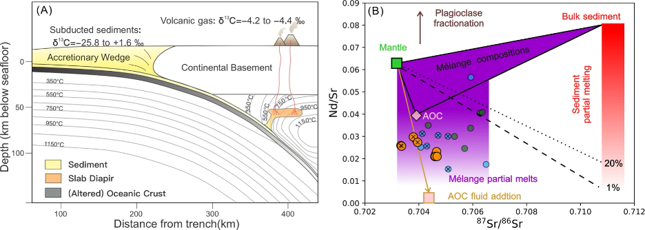

## Abstract

This manuscript examines the return of subducted organic carbon in Makran arc
volcanism. It links sediment inputs, volatile transfer, and isotope constraints
to evaluate how efficiently organic carbon can be recycled from the subducting
plate into arc volcanic outputs.

Status: under review.

  <a href="mailto:zengguangping22@mails.ucas.ac.cn">Email</a>
  <a href="https://scholar.google.com/citations?user=MfU38ZMAAAAJ">Google Scholar</a>

