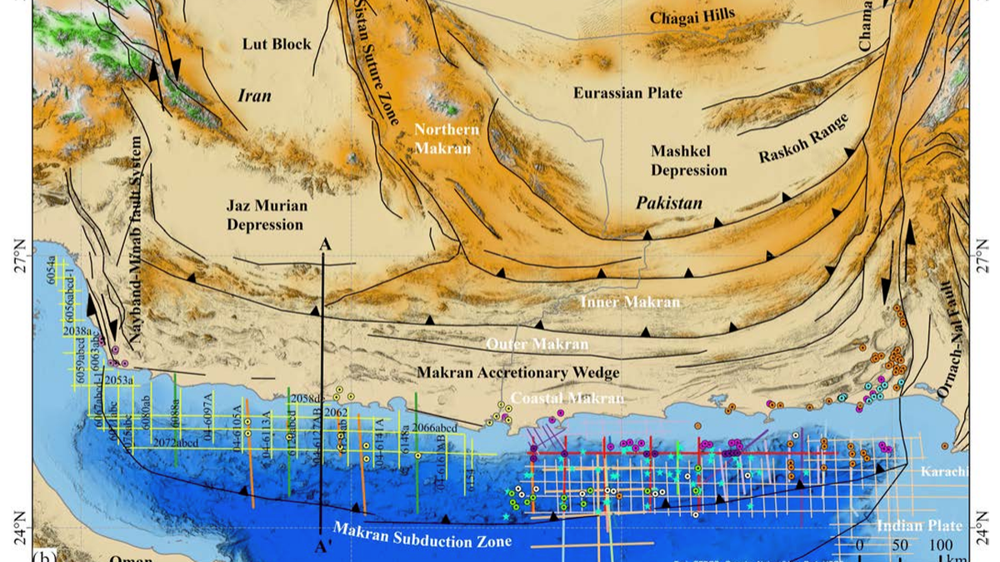

## Abstract

This paper examines how mud-intrusive and mud-extrusive systems develop in the
Makran accretionary wedge, a sediment-rich convergent margin above the
northward-subducting Arabian Plate. By integrating 2D multichannel seismic
profiles, bathymetry, seismic attributes, and satellite observations, the study
maps offshore and onshore mud structures and evaluates how faults, folds,
source intervals, and feeder geometries control mud and fluid migration.

The study identifies 67 seismic mud structures and proposes a Makran-specific
classification that distinguishes deep-source mud volcanoes, shallow-source
mud volcanoes, multi-source mud volcanoes, and multi-source mud diapirs. These
features point to a multi-level plumbing system concentrated along major
structural domains, with bottom-simulating reflectors suggesting active
hydrate/free-gas related fluid migration. The results provide a process-based
model for mud-system evolution in Makran and a comparison framework for other
mud-rich accretionary margins.

Marine Geoscience and Energy Resources, 193, 207833. Published online 3 July
2026. DOI: [10.1016/j.marger.2026.207833](https://doi.org/10.1016/j.marger.2026.207833).

  <a href="https://doi.org/10.1016/j.marger.2026.207833">DOI</a>
  <a href="mailto:zengguangping22@mails.ucas.ac.cn">Email</a>
  <a href="https://scholar.google.com/citations?user=MfU38ZMAAAAJ">Google Scholar</a>

